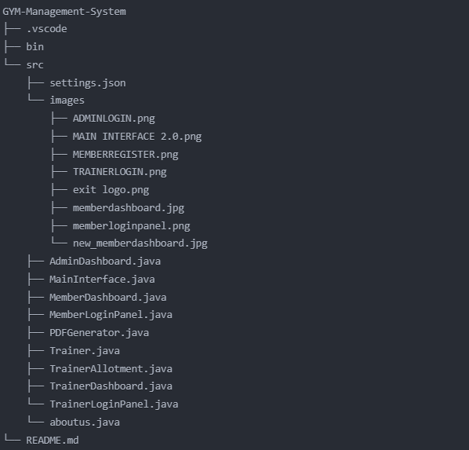

# FITCORE Gym Management System

## Overview

FITCORE is a comprehensive Java-based solution designed to streamline gym operations. This system handles processes such as member registration, trainer assignments, and workout schedule creation. With a user-friendly interface built using Java Swing and a robust MySQL backend, FITCORE ensures scalability and efficiency.

## Features

- **Role-Based Login System**:
  - Dedicated login panels for Admins, Trainers, and Members.
- **Member and Trainer Management**:
  - Add, edit, or delete profiles with details like fitness goals, schedules, and personal information.
- **Workout Plan Automation**:
  - Generate tailored workout plans and assign trainers based on availability and goals.
- **Dashboards**:
  - **Admin**: Manage gym profiles, create schedules, and generate reports.
  - **Trainer**: View assigned members and schedules.
  - **Member**: Access workout plans and update personal information.

## Technology Stack

- **IDE**: Visual Studio Code
- **Frontend**: Java Swing and AWT
- **Backend**: MySQL database
- **Programming Language**: Java

## Project Structure

- **`src` Folder**: Contains the source code for the application, organized into modular Java classes such as:
  - `AdminDashboard.java`: Admin functionalities.
  - `TrainerDashboard.java`: Trainer-related tasks.
  - `MemberDashboard.java`: Member-specific operations.
- **`images` Folder**: Stores GUI images, including login and dashboard designs.
- **`bin` Folder**: Contains compiled `.class` files.

The modular structure ensures clear separation of responsibilities and easy navigation within the project.

## System Workflow

1. **User Input**: Users interact with login screens and dashboards.
2. **Validation**: Input data is verified for accuracy.
3. **Business Logic**: Handles scheduling, trainer allocation, and profile updates.
4. **Database Operations**: Stores and retrieves data using MySQL.
5. **Result Presentation**: Displays outcomes on tailored dashboards for each user role.

### Visual Representation

 
*Depicts the flow of data from user input to result presentation.*

## Objectives

- Automate routine gym tasks to enhance efficiency.
- Offer a scalable and user-friendly system for gym management.
- Simplify the management of members, trainers, and schedules.

## Installation and Usage

1. Clone this repository:
   ```bash
   git clone https://github.com/Itz-Om17/GYM-Management-System.git
